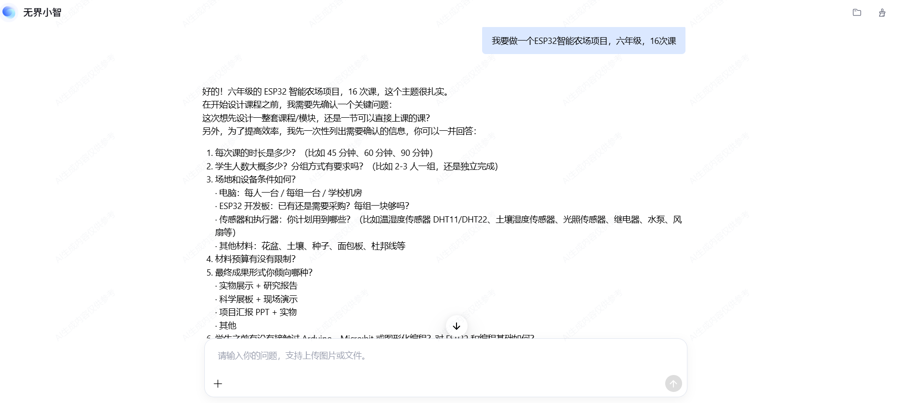
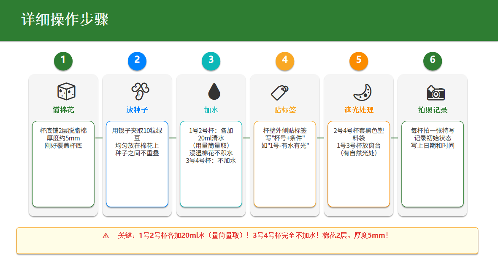
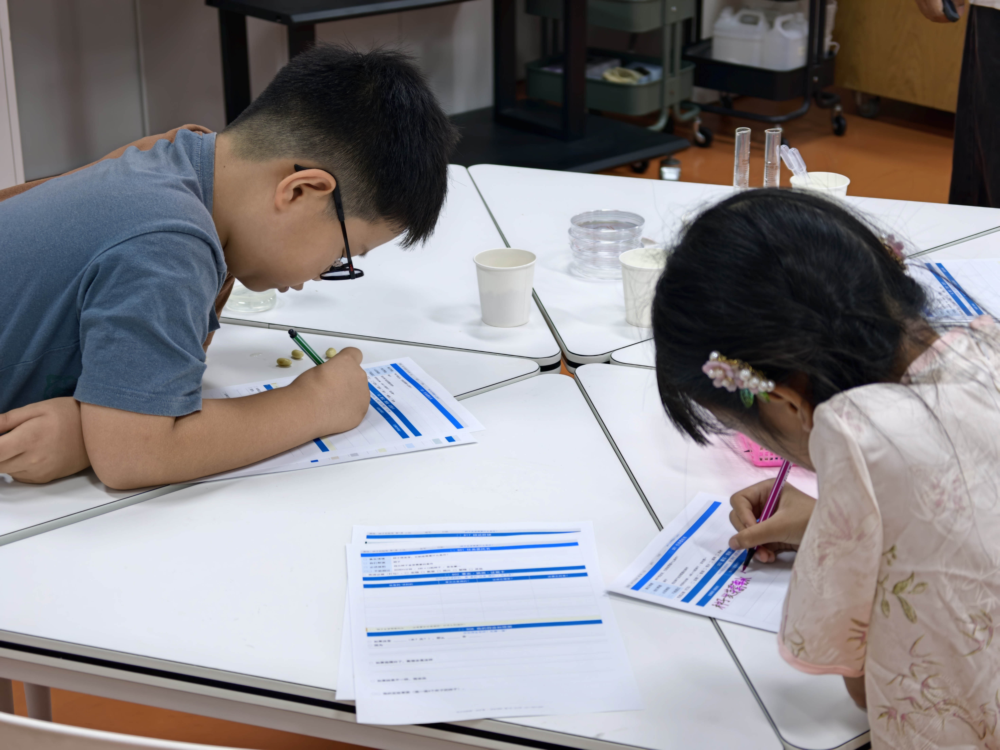

# IBL Course Designer

> 项目制学习/研究性学习课程设计Skill。把教师的模糊想法变成直接能用的教案和学生留痕物料

[](LICENSE)


---

## 这是什么
IBL Course Designer是一个面向中小学教师的AI x 研究性学习（Inquiry-Based Learning）和项目制学习（Project-Based Learning）课程设计skill。教师只需要用自然语言描述一个初步想法（例如：我想设计一个ESP32智能农场的项目），skill便会与教师确认课程尺度、学生年龄、课时数量、场地设备、材料预算、AI使用方式和最终成果等关键条件，形成一份待确认的课程框架。教师确认后，skill将继续生成一套可以直接进入教学实施的课程资源，详见下方详细能力章节。它遵循研究性学习与研究性学习的基本方法，确保学生经历提出问题 → 建立假设 → 设计实验 → 收集证据 → 使用AI辅助分析 → 核验结果 → 形成结论 → 展示与反思的完整过程。

## 为什么需要这个skill
近年来，项目化学习、跨学科学习和科学探究正在从少数学校的特色探索，逐渐变成义务教育阶段需要常态化落实的教学任务。2021年，“双减”后的课后服务全面推行“5+2”模式。《义务教育课程方案和课程标准（2022年版）》要求，原则上各门课程使用不少于 10% 的课时开展跨学科主题学习。2023年，教育部等十八部门提出在“双减”中做好科学教育加法。2025年发布的《中小学科学教育工作指南》进一步强化了课程实施、探究实践、教师队伍、过程评价和档案管理要求。2026年8月，教育部发布义务教育阶段科学教育“做中学”领航行动指南，要求围绕真实问题开展跨学科探究实践。其中，四至九年级每名学生每学期应完成不少于一项、且不少于四课时的科学探究任务。
政策已经回答了“学校要不要开展研究性、跨学科探究课程”的问题，但没有回答“普通教师如何在有限的备课时间、材料、设备和专业背景下，把这些要求转化为一门真正能够上起来的课程？”
经过调查，我们发现，教师面临的困难通常不是想不到一个有趣主题，而是不知道怎样把主题转化为可研究的问题、不知道如何评价开放性的学生成果、需要花费大量时间制作教学物料。通用AI工具给出的内容看似丰富，却经常缺少真实实验和教学可行性。IBL Course Designer的目标，就是补上从政策要求和课程想法到真实课堂实施之间的这段空白。

## IBL Course Designer适合谁
- 需要设计跨学科主题学习的学科教师；
- 承担科学社团、兴趣班或课后服务课程的教师；
- 需要开发项目化学习课程的教研员和课程负责人；
- 需要建设校本课程、科技节或综合实践课程的学校；
- 希望把AI引入课堂，但不希望学生只用 AI 搜答案的教师。

## 效果展示

<!-- TODO: 替换为实际截图。删除 docs/images/README-SCREENSHOTS.md 后此注释可移除 -->
<p align="center">
  
  <br />
  <sub>教师对话 → 框架确认 → 生成完整教案、PPT 和学生物料</sub>
</p>

<p align="center">
  
  <br />
  <sub>当节课 PPT：内容简洁、要点逐步呈现、教师备注和 AI 核验提示</sub>
</p>

<p align="center">
  
  <br />
  <sub>部分学生留痕物料：共情地图、变量桌垫、AI 核验单、失败侦探单</sub>
</p>


## Skill 详细能力

### 先搜索，再设计

在生成任何课程内容之前，自动搜索课标、已有课程案例、真实实验数据、材料规格和已有物料模板。待确认框架会直接展示完整网址、发布方、关键信息、采用方式和限制；完整套件另附检索与设计依据文件。

### 设计整套课程时的产出

1. **课程定位与简介** — 年级、节次、时长、主问题、最终项目
2. **适合学生** — 基础、兴趣画像、前置知识、不适合情形
3. **五类可评价目标** — 研究思维、实验设计、AI 协同、工具技能、协作表达
4. **模块总览与逐节课表** — 每节写明课题、研究方法、动手任务、AI 任务、引导问题、留痕物料
5. **结营成果系统** — 个人实体成果、小组成果、班级展示、过程档案
6. **评价设计** — 诊断/形成性/总结性检查点，4 级表现量规
7. **材料与设备清单** — 公共设备、每组材料、逐节消耗品、数量公式、替代方案
8. **课前准备时间线** — 开课前 2-4 周到结营展示
9. **实施保障** — 设备排队、无障碍、低网络、缺席补做方案
10. **前后测** — 各约 20 题，A-D 选项按理解程度赋 1-4 分并报告成长
11. **课程质量自检** — 逐条检查

### 设计单节课时的产出

| 文件 | 格式 | 内容 |
|---|---|---|
| **检索与设计依据** | .pdf/.docx | 完整来源、网址、摘要、采用方式、许可和待核实项 |
| **教师教案** | .pdf/.docx | 课程信息、目标、逐分钟流程、话术、材料、AI 使用、前后测评分和应急预案 |
| **课堂课件** | .pptx | 每页内容简洁；多要点自动展开为 `1 → 1+2 → 1+2+3` 累积展示页 |
| **学生物料包** | A4 .pdf/.docx | 一个环节一页，根据课程进度挑选留痕卡片 |
| **前后测** | .pdf/.docx | 前后测各约 20 题，学生卷隐藏权重，教师版解释每个选项的 1-4 分 |
| **模拟数据卡片** | .pdf | 实验模拟数据，供教师在学生无差异或时间不足时参考 |

### 原生 Office 生成

Skill 内置 `tools/render_office.py`。模型只输出紧凑 JSON，脚本使用 `python-pptx` 和 `python-docx` 生成原生 PPTX/DOCX，统一处理页面、字体、表格、备注和累积构建页，不需要每次让模型重新编写转换代码。可选用 LibreOffice 把 DOCX 转成 PDF。

### 学生物料库（20 种）

根据课程进度动态挑选：前期课时（第 1-3 课）每课 4-6 张卡片侧重问题发现，中期（第 4-8 课）每课 3-5 张侧重方案设计，中后期（第 9-12 课）每课 2-4 张侧重实验数据，后期（第 13-16 课）每课 2-3 张侧重结论和复盘。

| 编号 | 名称 | 用途 |
|---|---|---|
| S01 | 任务委托书 | 明确真实情境、需求、约束和完成证据 |
| S02 | 事实/猜测/证据卡 | 区分观察到的事实、猜测和证据来源 |
| S03 | 共情地图 | 捕捉使用者看到、听到、说做、想感受 |
| S04 | 观察放大镜 | 记录形状、颜色、数量、尺寸、变化 |
| S05 | 问题漏斗与 HMW | 从宽问题缩小到可测研究问题 |
| S06 | 资料与来源核验卡 | 评估来源可信度，追溯原始证据 |
| S07 | AI 协作核验单 | 记录 AI 建议、核验方法、最终取舍 |
| S08 | 假设与预测 | 提出可验证假设和预期数据表现 |
| S09 | 变量与公平测试桌垫 | 识别自变量、因变量、控制变量、对照和重复 |
| S10 | 实验/测试方案蓝图 | 写明材料、步骤、测量、分工和安全检查 |
| S11 | 原始数据表 | 定制表头，记录原始值，不预填结果 |
| S12 | 失败侦探单 | 记录失败事实、可能原因、证据和下一版改进 |
| S13 | 创意八格 | 5-8 分钟内每格一种方案，快速发散 |
| S14 | 方案选择矩阵 | 按标准评分，不事后改权重 |
| S15 | 用户旅程/操作流程 | 分析使用者在各阶段的困难和改进机会 |
| S16 | 同伴反馈单 | 基于证据的有效之处、疑问和建议 |
| S17 | 结论阶梯 | 区分数据支持、合理推测和未知限制 |
| S18 | 个人贡献页 | 记录每人负责的任务、判断和修改 |
| S19 | 展品标签 | 写明问题、证据、结论和观众互动 |
| S20 | 退出条 | 2-3 题快速检测本课掌握程度 |

## 设计原则

1. **一个主题贯穿全程** — 前期实验为最终项目提供现象、方法和数据基础
2. **研究方法是主角** — 每节课至少显性训练一种研究方法
3. **AI 是学伴，不是答案机器** — 学生必须核验 AI 建议，保留判断和取舍记录
4. **先小实验，再完整研究** — 前 20% 建立现象，中间 55% 训练方法，最后 25% 完成闭环
5. **研究问题必须可完成** — 课程周期内能观察到变化，学生可亲手操作
6. **每节课留下可见痕迹** — 实体产出优先，数字成果需打印或装订
7. **结营成果必须外化** — 每人带走实物，每组完成项目，班级可展示


## 快速开始
本项目的ZIP遵循 [Agent Skills 开放规范](https://cloud.tencent.com/document/product/1759/134602)，可用于支持Agent Skill的平台。按照以下三步即可开始使用。

1. 下载已经打包好的文件[`dist/IBL-course-designer.zip`](dist/IBL-course-designer.zip)。

2. 在你的Agent平台中（如Workbuddy、Qoder等），进入Skill、能力扩展或知识与工具配置页面，上传IBL-course-designer.zip。不同平台的菜单名称和操作方式可能略有不同，请以对应平台的说明为准。如果你使用的是自建的CLI + 大模型API，可以将解压后的Skill文件夹放入项目的Skills目录，并在Agent配置、系统提示词或启动参数中明确指定Skill的路径和加载方式。

3. 向Agent描述你的初步课程想法即可，例如：
> 我想给五年级学生设计一门种子萌发研究课。

> 我想设计一个ESP32智能农场项目，面向六年级学生，共16课时。

> 我想做一个冰箱食材追踪项目，让学生学习传感器、数据记录和AI图像识别。

Skill会继续与你确认学生年龄、课时数量、教学目标、设备材料、班级人数和最终成果等关键信息，然后先生成课程框架。框架确认后，再生成完整教案和配套教学物料。


## 开发与测试

```powershell
# 校验 Skill 源目录
python scripts/validate_skill.py --source .

# 安装并试运行原生 Office 生成器
python -m pip install -r tools/requirements.txt
python tools/render_office.py tools/example-kit.json --output-dir output

# 运行离线测试
python -m unittest discover -s tests -v

# 打包并校验 ZIP
python scripts/package_skill.py
python scripts/validate_skill.py --zip dist/IBL-course-designer.zip
```

## License

[MIT](LICENSE)
